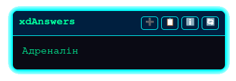

# 🇺🇦xdAnswers

A free and open-source extension that helps you with tests using the power of artificial intelligence.

> [!IMPORTANT]  
> This project still in **BETA** testing. If you see bug, [create issue](https://github.com/aartzz/xdAnswers/issues) about it.

 
## 🚀 Key Features

* **AI-Powered Answers:** Get answers to test questions using advanced language models.
* **Multi-Service Support:** Integrates with MistralAI, OpenAI, Google Gemini, and local models via Ollama.
* **Image Recognition:** The extension can analyze images in both questions and answer options.
* **Convenient UI:** A floating helper window that you can move and resize.
* **Flexible Configuration:** Manage API keys, models, and system prompts through a user-friendly popup window.

## ⚙️ How to Install

**Step 1: Go to the Releases Page**

1.  Navigate to the **[Releases](https://github.com/aartzz/xdAnswers/releases)** page of this repository.
2.  Find the latest release, which will be marked with a `Latest` tag.

**Step 2: Download the Correct File for Your Browser**

Under the **Assets** section of the latest release, download the appropriate file:
* For **Chrome, Kiwi, or other Chromium browsers**, download the `xdAnswers-chrome-vX.X.X.zip` file.
* For **Firefox**, download the `xdAnswers-firefox-vX.X.X.xpi` file.

**Step 3: Install the File in Your Browser**

#### 🖥️ Google Chrome (Dektop)

1.  Download the `...chrome...zip` file and **unzip it** into a new folder.
2.  Open Chrome and navigate to `chrome://extensions`.
3.  In the top-right corner, enable **Developer mode**.
4.  Click the **Load unpacked** button that appears on the left.
5.  In the file selection window, choose the **folder you just unzipped**.
6.  Done! The extension's icon will appear in your toolbar.

#### 🦊 Mozilla Firefox (Mobile & Desktop)

> [!WARNING]  
> For mobile, you need install [Firefox Nightly](https://play.google.com/store/apps/details?id=org.mozilla.fenix).
>
> For desktop, you need install [ESR](https://www.mozilla.org/firefox/organizations) or [Dev edition](https://www.mozilla.org/firefox/developer) or [Nightly](https://nightly.mozilla.org)

1.  Open your new developer version of Firefox.
2.  In the address bar, type `about:config` and press Enter.
3.  A warning page may appear. Click "Accept the Risk and Continue".
4.  In the search bar at the top of the page, type `xpinstall.signatures.required`.
5.  You will see the preference listed. Double-click on it to change its value from `true` to **`false`**.
6.  Now, you can install the add-on permanently. Download the `...firefox...xpi` file from the latest release and simply **drag and drop** it onto any Firefox window. It will install without any verification errors and will remain active after you restart the browser.

---

### For Developers

This method is for those who want to modify the code or test the latest unreleased changes.

1.  Clone the repository or download the source code as a ZIP file and unzip it.
    ```bash
    git clone https://github.com/aartzz/xdAnswers.git
    ```
2.  Follow the "Load unpacked" instructions for your browser (Chrome or the "Temporary Add-on" method for Firefox) as described above, but select the source code folder you just cloned/downloaded.

## 💡 How to Use

1.  After installation, click the extension's icon in your browser's toolbar to open the settings.
2.  Select your preferred service (e.g., MistralAI).
3.  If the service requires an API key (like OpenAI or Gemini), paste it into the appropriate field.
4.  Click "Save and Close".
5.  Navigate to a test on one of the supported sites.
6.  The helper window will appear automatically and display the answer to the current question.

## ✅ Supported Sites

-   [🇺🇦 NaUrok](https://naurok.com.ua)
-   [🇺🇦 Vseosvita](https://vseosvita.ua) [BETA]
-   [🌐 Google Forms](https://docs.google.com/forms) [BETA]

## 📝 To-Do

-   Add more support for educational platforms.
-   Fix bugs and improve stability.