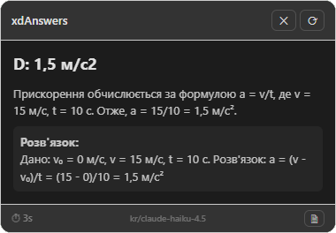

# xdAnswers

**🇺🇦 Українська** | [🇬🇧 English](README-en.md)


Безкоштовне розширення для Chrome, яке розв'язує тестові питання за допомогою ШІ.

Працює з коробки — вбудовані безкоштовні провайдери, API-ключ не потрібен.
> [!IMPORTANT]  
> **Бета** — баги бувають. [Звітуйте про них](https://github.com/aartzz/xdAnswers/issues).



## Можливості

- **Безкоштовно за замовчуванням** — 4 вбудовані провайдери без API-ключа: Unturf Hermes, Unturf Qwen, Unturf Vision (для зображень), OpenCode Zen
- **Будь-який OpenAI-сумісний API** — OpenAI, Anthropic, Gemini, DeepSeek, Groq, локальний Ollama, що завгодно
- **Розпізнавання зображень** — обробляє зображення в питаннях та варіантах відповідей (через провайдери з підтримкою vision)
- **Пошук в інтернеті** — модель може самостійно шукати актуальну інформацію в мережі (через LangSearch / SearXNG, до 3 ітерацій)
- **Тихі режими** — індикатори (точка біля правильної відповіді), заголовок сторінки, стелс (тільки буфер обміну) або one-click (клік на питання для відповіді)
- **Автовідповідь** — автоматично обирає правильний варіант із налаштовуваною затримкою (cooldown)
- **Консенсус** — запускає відповідь кількома моделями одночасно та обирає варіант більшості
- **Плаваючий помічник** — перетягуваний, показує відповідь + пояснення + витрачений час
- **Мультиязичність** — інтерфейс українською, російською та англійською
- **Кастомні теми** — обери готову або створи свою з + кнопкою
- **Disabler (обхід анти-читу)** — універсальний та специфічний для кожного сайту (детальніше нижче)

## Disabler (обхід анти-читу)

Розширення містить **два рівні обходу анти-чит систем**:

### Універсальний (вмикається в налаштуваннях)
Працює на всіх сайтах одночасно:
- **Blur / Focus bypass** — блокує події blur, focus, focusin, focusout, щоб сайт не бачив перемикання між вкладками
- **Visibility API spoofing** — завжди повідомляє `visibilityState = 'visible'` та `hidden = false`
- **Перехоплення visibilitychange** — приховує справжній стан видимості сторінки

### Специфічний для сайту (вбудований у провайдери)
Кожна платформа має власні методи обходу:
- **Naurok** — приховування помічника, мінімізація слідів у DOM
- **Vseosvita** — обхід захисту від копіювання та перемикання
- **JustClass / Classtime / Miyklas / lCloud** — специфічні патчі для кожного сайту

> [!WARNING]
> Disabler не гарантує 100% невидимості. Використовуйте на власний розсуд.

## Тихі режими (Silent Modes)

Режими, коли помічник прихований або мінімізований:

| Режим | Опис |
|:---|:---|
| **Indicators** | Зелена точка біля правильної відповіді, без показу тексту |
| **Ghost** | Відповідь показується тільки в заголовку вкладки браузера |
| **Stealth** | Відповідь копіюється в буфер обміну, ніяких візуальних ознак на сторінці |
| **One-click** | Клік по контейнеру питання запускає відповідь (без автоматичного спрацювання) |

## Консенсус (Consensus)

Запускає одне й те саме питання через кілька різних моделей одночасно, потім:
- Нормалізує відповіді (ігнорує регістр, зайві пробіли, префікси типу "А:")
- Обчислює більшість (majority voting)
- Показує рівень згоди (agreement %) між моделями
- Стани: `unanimous` (одноголосно), `majority` (більшість), `no-consensus` (немає згоди)

## Встановлення

### Десктоп (Chrome, Brave, Edge, Vivaldi)

1. Перейдіть до [Releases](https://github.com/aartzz/xdAnswers/releases), завантажте останній `xdAnswers-chrome-*.zip`
2. Розпакуйте
3. Відкрийте `chrome://extensions`, увімкніть **Режим розробника** (справа вгорі)
4. Натисніть **Завантажити розпаковане розширення**, оберіть розпаковану папку

### Мобільний (Kiwi Browser)

1. Встановіть [Kiwi Browser](https://github.com/kiwibrowser/src.next/releases/tag/14310011181) з GitHub
2. Перейдіть до [Releases](https://github.com/aartzz/xdAnswers/releases), завантажте останній `xdAnswers-chrome-*.zip`
3. Відкрийте `kiwi://extensions`, увімкніть **Режим розробника**
4. Натисніть **Завантажити розпаковане розширення**, оберіть розпаковану папку

### Firefox

Розширення підписано Mozilla — працює на будь-якій версії Firefox без додаткових налаштувань.

1. Завантажте `xdAnswers-firefox-*.xpi` з [Releases](https://github.com/aartzz/xdAnswers/releases)
2. Перетягніть файл `.xpi` у вікно Firefox → підтвердіть встановлення

### Збірка з вихідного коду

Потрібен [Node.js](https://nodejs.org/) 18+ (щоб був доступний `npm`).

```bash
git clone https://github.com/aartzz/xdAnswers.git
cd xdAnswers
npm install
```

Далі оберіть ціль:

```bash
# Firefox — підписаний .xpi у ./build/xdAnswers-firefox-<version>.xpi
npm run sign:firefox

# Chrome/Brave/Edge/Vivaldi — готовий .zip у ./build/xdAnswers-chrome-<version>.zip
npm run build:chrome
```

> [!NOTE]
> Для підписання Firefox-розширення потрібні облікові дані Mozilla Add-ons API. Створи файл `.env` у корені проєкту (дивись `.env.example`) або передай їх через змінні середовища `WEB_EXT_API_KEY` / `WEB_EXT_API_SECRET`.

Готові артефакти лежать у папці `./build`. Далі встановлюйте їх так само, як і реліз-файли (див. розділи вище).

> [!TIP]
> Скрипти `build:firefox` / `build:chrome` крос-платформні (працюють на Windows, macOS, Linux) — вони автоматично генерують правильний `manifest.json` для вибраного браузера, пакують розширення через `web-ext` і прибирають тимчасові файли.

### Режим розробки (hot reload)

Для ітеративної розробки зручно використовувати режим `web-ext run`, який запускає тимчасовий профіль браузера з уже завантаженим розширенням і автоматично перезавантажує його при змінах у файлах:

```bash
# Спочатку згенеруйте manifest.json для потрібного браузера
node scripts/build-manifest.js firefox    # або chrome

# Firefox — відкриється тимчасовий Firefox з розширенням
npx web-ext run

# Chrome/Chromium (потребує встановленого Chrome)
npx web-ext run -t chromium
```

Після завершення сесії приберіть згенерований `manifest.json` командою `npm run clean`.

## Використання

1. Натисніть іконку розширення → відкриються налаштування
2. Оберіть провайдер (Unturf Vision за замовчуванням, працює безкоштовно)
3. Якщо використовуєте платний API, вставте свій ключ
4. Відкрийте тест на підтримуваному сайті — помічник з'явиться автоматично

## Підтримувані сайти

| Сайт | URL | Статус | Авто-Відповідь | Disabler | Silent mode |
|------|-----|--------|:--------------:|:--------:|:-----------:|
| НаУрок | [naurok.com.ua](https://naurok.com.ua) | стабільний | ✅ | ➖ | ✅ |
| Всеосвіта | [vseosvita.ua](https://vseosvita.ua) | бета | ✅ | ✅ | ✅ |
| JustClass | [justclass.com.ua](https://justclass.com.ua) | бета | ❌ | ⚠️ | ⚠️ |
| Kahoot! | [kahoot.it](https://kahoot.it) | бета | ❌ | ✅ | ⚠️ |
| Classtime | [classtime.com](https://classtime.com) | бета | ❌ | ⚠️ | ⚠️ |
| МійКлас | [miyklas.com.ua](https://miyklas.com.ua) | бета | ❌ | ⚠️ | ⚠️ |
| LCloud | [lcloud.in.ua](https://lcloud.in.ua) | бета | ❌ | ⚠️ | ⚠️ |
| Google Forms | [docs.google.com/forms](https://docs.google.com/forms) | бета | ✅ | ➖ | ✅ |
| Microsoft Forms | [forms.office.com](https://forms.office.com) | бета | ✅ | ➖ | ✅ |
| Quizlet | [quizlet.com](https://quizlet.com) | бета | ❌ | ⚠️ | ⚠️ |
| Szkoła w Chmurze | [szkolawchmurze.org](https://szkolawchmurze.org) | бета | ❌ | ⚠️ | ⚠️ |
| TestPortal | [testportal.pl](https://testportal.pl) | бета | ❌ | ⚠️ | ⚠️ |

**Умовні позначення:** "стабільний" — повне покриття форматів питання | "бета" — часткове покриття форматів питання | ✅ — повністю підтримується | ⚠️ — частково / у розробці | ❌ — не підтримується | ➖ — не планується
